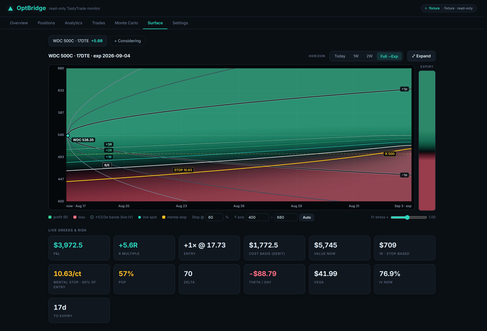
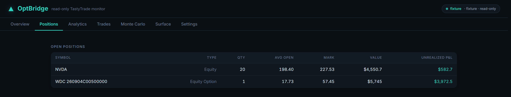
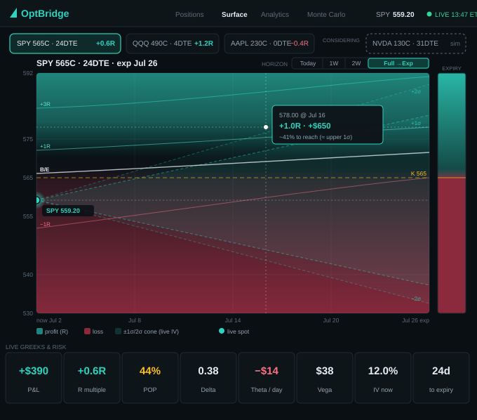
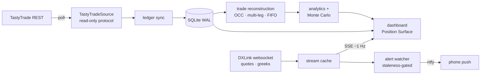
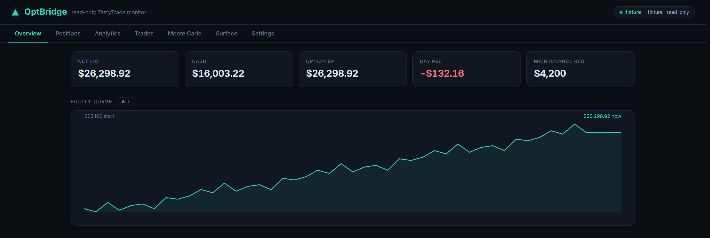
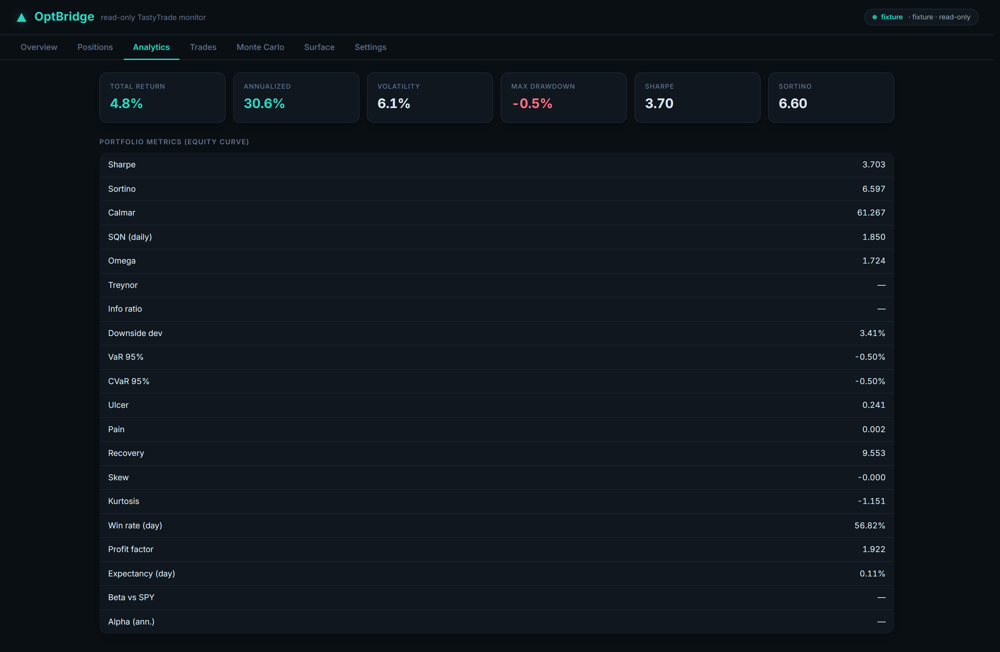
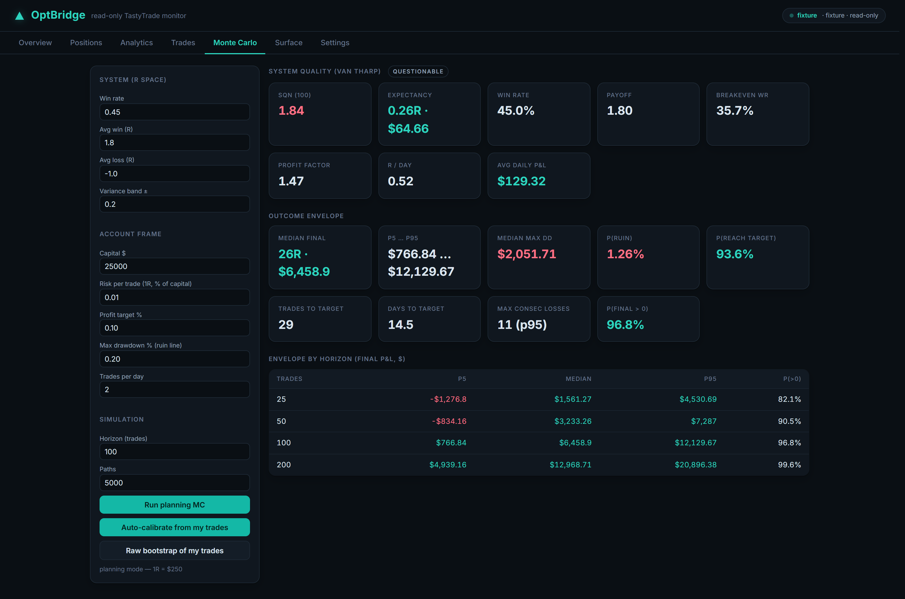

# OptBridge

**A local-first, read-only options portfolio monitor for TastyTrade** — real-time position
tracking, risk analytics, Monte Carlo simulation, and the **Position Surface**: a live P&L
heatmap for options positions.

Personal project, designed and built solo in Python. This is a **showcase repository** —
the application source is private, but I'm happy to walk through the code and architecture
in detail.

> Screenshots run against the built-in demo dataset (fixture mode), not a live account.
> The open position is a real contract — a WDC 09/04/26 500 call bought at 17.73, with the
> underlying, mark, implied vol and greeks captured from the live options feed on
> 2026-08-17. Account balances and closed trade history are synthetic.

## What it is

OptBridge runs as a local FastAPI server + browser dashboard on the trader's own machine.
It connects to TastyTrade with **read-only** OAuth scope, streams real-time quotes and
greeks over DXLink websockets, reconstructs trade history from the transaction ledger, and
answers the questions a price chart can't:

- What is my *position* worth — everywhere price and time could go?
- How likely is price to be where my profit zone is, before theta melts it?
- What does my track record actually say about my edge?

## The Position Surface

The signature view: position P&L in **R-multiples** rendered as a price × time heatmap,
anchored to the live streaming mark.

- Black-Scholes valuation grid with **marching-squares iso-R contours**
  (+3R / +2R / +1R / break-even / −1R), labeled on-path
- **Live IV probability cone** (±1σ/2σ/3σ) from streaming implied vol — profit zone vs.
  probable price paths at a glance, with hover probability readouts
- **Mental-stop integration:** the stop is defined as a percentage of entry value; the
  surrendered amount becomes the true 1R and every contour re-bases onto it — the −1R
  contour *is* the stop line, drawn on the surface
- Log-space auto-ranging (a 100%+ IV underlying breaks linear price ranges) with manual
  Y-axis override — the shot above is framed to 400–680 so the iso-R fan is legible, since
  a 77% IV name's full ±2σ range squashes it. Plus a horizon toggle (Today / 1W / 2W /
  to-expiration), near-fullscreen expand, live greeks rail, and a hover crosshair on a
  separate canvas layer so 1 Hz live re-renders never fight the mouse
- Multi-leg positions aggregate into one surface; a "Considering" mode renders
  hypothetical entries through the same engine before any order exists

Designed as a static mockup first, then built to match:

## Engineering highlights

- **Real-time pipeline:** OAuth → DXLink websocket (Quote / Greeks / Candle events) →
  in-process cache → Server-Sent Events → the dashboard patches the active surface in
  place at ~1 Hz. The fully-async broker SDK is bridged onto a dedicated event-loop
  thread behind a synchronous facade.
- **Options-aware trade reconstruction:** OCC symbology, ×100 multiplier, multi-leg
  grouping via order ids, expirations and assignments treated as closes; FIFO round-trips
  produce the R-multiple dataset that feeds all per-trade analytics.
- **Two statistical views, kept separate:** per-trade (Van Tharp expectancy, SQN, profit
  factor, R-distribution) and portfolio equity-curve (Sharpe, Sortino, Calmar, VaR/CVaR,
  Ulcer index, max drawdown) — with minimum-sample-size gating in the UI so small-n stats
  don't masquerade as signal.
- **Monte Carlo:** a planning mode that ports a validated spreadsheet model
  (parity-tested against the original workbook) and a track-record mode that bootstraps
  real fills; risk-of-ruin is empirical and path-based, never the closed-form
  approximation (which fails at strong edge).
- **Alert layer** (ntfy push to phone): mental-stop hit, hourly session digests, relative
  IV spike/drop — all gated behind a **stream-staleness watchdog**, because an alert
  engine reading a frozen mark is worse than no alert engine at all.
- **Reliability discipline:** 122 unit tests; injected clock (no `datetime.now()` in
  business logic); realized P&L computed only from the transaction ledger, never from
  marks; runs windowless as a logon task with auto-restart.

## Read-only by construction

There is no order-submission code anywhere in the package. The broker-source protocol
exposes no write methods — enforced at the interface layer and asserted in tests.
OptBridge watches; it never trades.

## Architecture

## More views

| Overview | Analytics | Monte Carlo |
|---|---|---|
|  |  |  |

## Stack

Python 3.11 · FastAPI + uvicorn · SQLite (WAL) · SQLAlchemy 2 / Pydantic v2 ·
pandas / NumPy / SciPy · TastyTrade SDK + DXLink websockets · single-file vanilla-JS
canvas dashboard (no framework) · PyInstaller

~4,500 lines of application Python, a ~1,400-line dashboard, 122 tests.

---

© 2026 Luke Griscom. All rights reserved.
